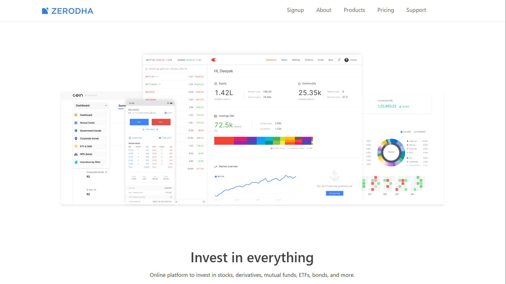

<div align="center">
  <br />
    <a>
      
    </a>
  <br />

  <div>
    
    
    
    
  </div>

  <h3 align="center">Welcome to Zerodha Clone – a full-stack stock trading platform built using the MERN stack, inspired by the popular Zerodha app.</h3>
</div>

---

## 📋 <a name="table">Table of Contents</a>

1. 🌟 [Overview](#overview)
2. 💻 [Tech Stack](#tech-stack)
3. 📦 [Packages & Libraries](#packages--libraries)
4. ⚙️ [Setup & Installation](#setup--installation)
5. 🎯 [Features](#features)
6. 🔗 [Demo & Screenshots](#demo--screenshots)
7. 📜 [License](#license)

---

## <a name="overview">🌟 Overview</a>

The **Zerodha Clone** project replicates core functionalities of a modern stock trading platform.  
It provides secure user authentication, dynamic dashboards, data visualization, and smooth client-side navigation — all powered by the **MERN stack**.  

This project demonstrates the use of **React.js** for the frontend, **Express.js** and **Node.js** for backend APIs, and **MongoDB** for scalable data storage. 

---

## <a name="tech-stack">💻 Tech Stack</a>

- **Frontend:** React.js  
- **Backend:** Node.js + Express.js  
- **Database:** MongoDB  
- **Deployment:** Vercel / Render (optional for live demo)  

---

## <a name="packages--libraries">📦 Packages & Libraries</a>

| Package / Library | Purpose |
|:------------------|:---------|
| **Bootstrap 5.3** | Responsive UI design |
| **Material UI** | UI components and styling |
| **Express.js** | Backend framework |
| **Mongoose** | MongoDB object modeling |
| **Bcrypt** | Password hashing |
| **JWT (JSON Web Token)** | Authentication |
| **Chart.js** | Data visualization |
| **Axios** | HTTP client for API requests |
| **React Router DOM** | Client-side routing |
| **Passport** | Authentication strategies |
| **CORS** | Cross-origin support |
| **Body-Parser** | Parse incoming requests |

---

## <a name="setup--installation">⚙️ Setup & Installation</a>

Follow the steps below to set up the **Zerodha Clone** project locally   

### **Prerequisites**
Make sure you have these installed:
- [Git](https://git-scm.com/)  
- [Node.js](https://nodejs.org/)  
- [npm](https://www.npmjs.com/)  

---

### **Cloning the Repository**
```bash
git clone https://github.com/<your-username>/zerodha-clone.git
cd zerodha-clone

Installing Dependencies

Install dependencies for backend, frontend, and dashboard:
cd backend
npm install
cd ../frontend
npm install
cd ../dashboard
npm install

Environment Variables:-
Create a .env file in the backend folder and add:
PORT=3000
MONGO_URL=your_mongodb_connection_url
JWT_SECRET=your_jwt_secret_key

Running the Application:-
npm start
Open your browser at http://localhost:3000

```

---
## <a name="features">🎯 Features</a>

**User Authentication & Authorization** — Secure login and signup using JWT and Bcrypt.

**Interactive Dashboard** — View charts and insights powered by Chart.js.

**Orders Page**— Manage user orders and trade activities.

**Responsive UI** — Optimized for all screen sizes using Material UI and Bootstrap.
**Real-Time API Calls** — Managed efficiently with Axios and Express APIs.

**Smooth Routing** — Seamless navigation with React Router DOM.

**Clean Code Architecture** — Modular, scalable, and easy to maintain.

---
## <a name="demo--screenshots">🔗 Demo & Screenshots</a>
🌍 Live Demo: [www.zerodha-clone.com](https://zerodha-clone-client.vercel.app)

💻 GitHub Repository: [zerodha-clone](https://github.com/sadatali123/Zerodha-Clone)

---

📸 Screenshots

Home Page:


Dashboard:

 ---
## <a name="license">📜 License</a>

This project is licensed under the MIT License.
You’re free to use, modify, and distribute this project for learning or open-source purposes.